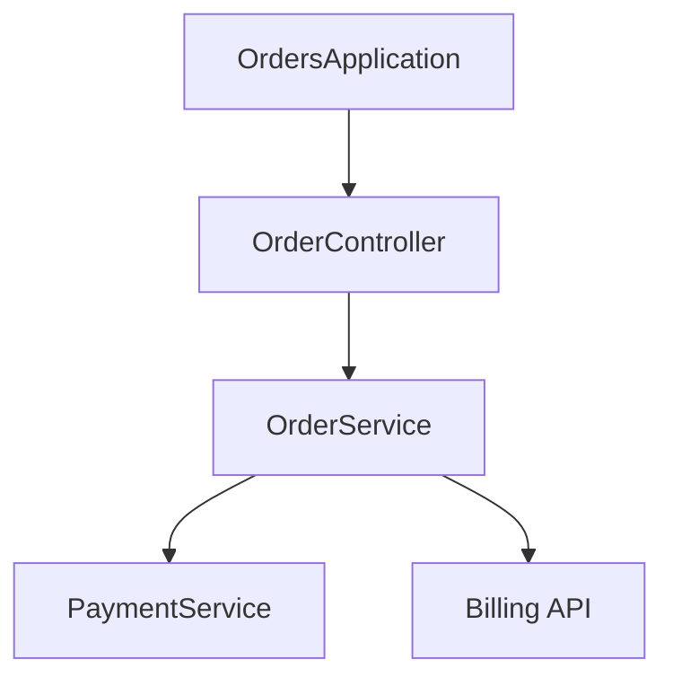
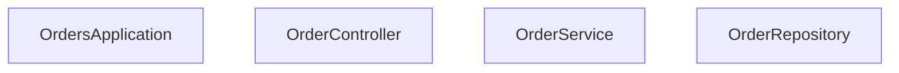

## WF-02 ARCH INTELLIGENCE

### 1. Objetivo

Definir cómo el servidor Sentinel-Arch identifica patrones arquitectónicos en proyectos Java basados en anotaciones y llamadas entre servicios, y cómo traduce esa información en **diagramas Mermaid (`graph TD`) válidos y coherentes**.

Este workflow se ejecuta **después** de `WF-01-PROJECT-DISCOVERY` y se alimenta de su representación jerárquica de módulos y paquetes.

### 2. Detección de patrones (anotaciones clave)

El análisis debe inspeccionar clases y anotaciones buscando:

- `@SpringBootApplication`
- `@RestController`
- `@Controller`
- `@Service`
- `@Repository`
- (futuro) `@FeignClient`, `@Component`, etc.

#### 2.1 Reglas de identificación

Para cada archivo Java en los paquetes descubiertos:

1. Localizar la **declaración de clase** o record:
   - `class`, `abstract class`, `record`, `@interface`.
2. Buscar anotaciones inmediatamente anteriores a la declaración de clase.
3. Asignar **roles**:
   - Si contiene `@SpringBootApplication` → marcar como **“Application Root”**.
   - Si contiene `@RestController` o `@Controller` → marcar como **“Controller”**.
   - Si contiene `@Service` → marcar como **“Service”**.
   - Si contiene `@Repository` → marcar como **“Repository”**.
4. Permitir múltiples roles por clase si aparecen varias anotaciones (por ejemplo, un servicio que también es componentizado).

El análisis puede implementarse inicialmente usando **búsqueda textual estructurada** (regex robustas) sobre el código fuente, con posibilidad de evolucionar a un parser más formal si se requiere mayor precisión.

### 3. Extracción de relaciones entre servicios

Se deben identificar relaciones lógicas entre componentes, especialmente entre servicios y endpoints remotos.

#### 3.1 Patrón FeignClient

Buscar interfaces o clases anotadas con `@FeignClient`:

- Extraer:
  - `name` o `value` (identificador lógico del servicio remoto).
  - `url` si está presente.
- Cualquier clase que **inyecte** esa interfaz (vía constructor, `@Autowired`, campo) debe registrarse como:

```text
<ClaseConsumidora> --> <NombreFeignClient>
```

#### 3.2 Patrón RestTemplate / WebClient

En clases marcadas como `@Service` o `@RestController`:

- Buscar usos de:
  - `RestTemplate` (`getForObject`, `postForObject`, `exchange`, etc.).
  - `WebClient` (`get()`, `post()`, `retrieve()`, etc.).
- Para cada invocación:
  - Extraer la URL base si es razonablemente deducible (por ejemplo, constante o propiedad simple).
  - Registrar relación “llama a” usando un identificador derivado de la URL (host + path base).

Ejemplo lógico:

```text
OrderService --> PAYMENT-SERVICE
OrderService --> http://billing.internal/api
```

(En la fase de generación de Mermaid, estos identificadores se normalizan a nombres de nodo válidos.)

### 4. Reglas para generar Mermaid (`graph TD`)

La salida estándar de este workflow es un **fragmento Mermaid** listo para incrustar en el reporte:



#### 4.1 Convenciones de nodos

- Prefijos sugeridos:
  - `APP_` para aplicaciones raíz (`@SpringBootApplication`).
  - `CTRL_` para controladores.
  - `SVC_` para servicios.
  - `REP_` para repositorios.
  - `EXT_` para dependencias externas (servicios HTTP remotos, etc.).
- El **ID del nodo** debe:
  - Ser único dentro del grafo.
  - Usar solo caracteres `[A-Za-z0-9_ ]` (evitando caracteres especiales que rompan Mermaid).
- La **etiqueta visible** puede ser el nombre simple de la clase o un alias corto.

Ejemplo:



#### 4.2 Convenciones de aristas

- Uso básico:
  - `A --> B` para dependencias directas (A usa/llama a B).
- Opcionalmente, se pueden etiquetar aristas con tipo de relación:
  - `A -- FeignClient --> B`
  - `A -- RestTemplate --> EXT_Service`

Se recomienda que en la **versión mínima** todas sean `-->` sin etiquetas, y que la información detallada se documente en texto en el reporte.

#### 4.3 Reglas de validación

- El fragmento resultante **debe**:
  - Comenzar con `graph TD`.
  - No contener la palabra `end` en minúsculas aislada (Mermaid la trata como palabra reservada).
  - Evitar IDs duplicados.

Si se detectan inconsistencias durante la generación (por ejemplo, ID duplicados), el workflow debe:

- Normalizar IDs añadiendo sufijos numéricos.
- Registrar un aviso en el log del servidor MCP.

### 5. Integración con LangChain4j

El workflow no implica que Mermaid sea generado exclusivamente de forma algorítmica. Un patrón recomendado:

1. **Extracción estructurada automática**:
   - Lista de clases y sus roles (controller, service, etc.).
   - Matriz de relaciones (quién llama a quién, cómo).
2. **Paso LLM (LangChain4j + Ollama)**:
   - Se entrega al modelo la estructura extraída.
   - Se solicita al LLM que:
     - Proponga un grafo Mermaid coherente (`graph TD`).
     - Siga las convenciones de prefijos y legibilidad definidas aquí.

El LLM **no debe** inventar servicios o relaciones no presentes en la extracción; solo puede agrupar, renombrar para claridad o filtrar ruido.

### 6. Trazabilidad

- Cada ejecución de `WF-02` debe poder asociarse a:
  - Un `rootPath`.
  - Un timestamp.
  - Un snapshot (JSON) de las relaciones detectadas previo al paso del LLM.
- Esta información es insumo para `WF-03-SENTINEL-REPORTING`.

