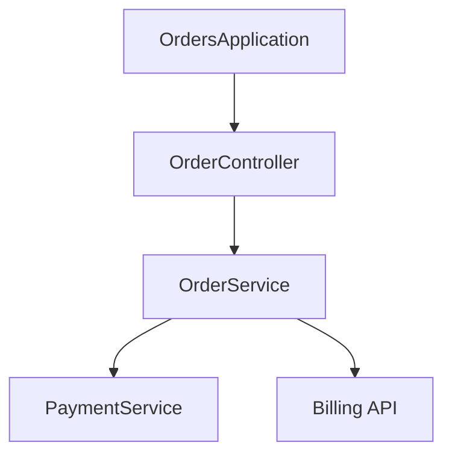

## WF-03 SENTINEL REPORTING

### 1. Objetivo

Definir la **estructura invariante** del reporte de arquitectura generado por Sentinel-Arch y las convenciones de nombrado de los artefactos de salida, garantizando trazabilidad entre:

- Ejecución del servidor MCP.
- Estado del proyecto analizado.
- Conclusiones y sugerencias generadas por el agente.

### 2. Convención de nombres de archivo

Todo reporte persistido en disco debe seguir la convención:

```text
SENTINEL_REPORT_YYYYMMDD.md
```

Donde:

- `YYYYMMDD` corresponde a la **fecha local** de la máquina que ejecuta el servidor (por ejemplo, `20260204`).
- Si se generan múltiples reportes el mismo día para el mismo proyecto, se recomienda agregar sufijos controlados:
  - `SENTINEL_REPORT_YYYYMMDD_01.md`
  - `SENTINEL_REPORT_YYYYMMDD_02.md`

El workflow puede mantener un contador interno por día o delegar en una función de utilería que calcule el siguiente índice disponible.

### 3. Estructura del reporte

El reporte final debe ser un archivo **Markdown bien formado**, con secciones claras en el siguiente orden:

1. **Header**
   - Contiene:
     - Timestamp en formato ISO-8601 (ej. `2026-02-04T10:15:30Z` o con offset local).
     - Ruta raíz analizada (`rootPath`).
     - Identificador de versión del servidor (`sentinel-backend-ai` + versión).
   - Ejemplo:

```markdown
# Sentinel Architecture Report

- Generated at: 2026-02-04T10:15:30Z
- Root path: C:\proyectos\orders-service
- Sentinel version: 1.0.0-SNAPSHOT
```

2. **Resumen ejecutivo**
   - 3–7 viñetas de alto nivel:
     - Tipo de arquitectura (monolito, microservicios, multi-módulo).
     - Número aproximado de módulos / servicios clave.
     - Principales riesgos o hallazgos (alto nivel).

3. **Tabla de dependencias**
   - Al menos dos vistas:
     - **Módulos / artefactos Maven** (si aplica).
     - **Servicios / componentes internos** identificados en `WF-02`.
   - Ejemplo:

```markdown
## Dependencias (Maven)

| Módulo           | GroupId          | ArtifactId        | Version   |
|------------------|------------------|-------------------|----------|
| raíz             | com.example      | orders-service    | 1.0.0    |
| orders-api       | com.example      | orders-api        | 1.0.0    |
| orders-core      | com.example      | orders-core       | 1.0.0    |

## Dependencias (Servicios internos)

| Origen          | Tipo     | Destino         | Tipo de llamada     |
|-----------------|----------|-----------------|---------------------|
| OrderService    | Service  | PaymentService  | FeignClient         |
| OrderService    | Service  | Billing API     | RestTemplate (HTTP) |
```

4. **Diagrama de arquitectura (Mermaid)**
   - Insertar el bloque Mermaid generado según `WF-02-ARCH-INTELLIGENCE`:

```markdown
## Diagrama de arquitectura


```

   - El LLM no debe modificar la sintaxis base (`graph TD`) ni agregar elementos no justificados por los datos estructurados.

5. **Sugerencias de refactorización (Clean Code)**
   - Secciones sugeridas:
     - **Complejidad / tamaño**:
       - Métodos o clases excesivamente largas.
       - Posibles candidatos a *Extract Method*, *Extract Class*, etc. (ver catálogos de refactorización como [Refactoring.Guru](https://refactoring.guru/refactoring/catalog)).
     - **Acoplamiento / cohesión**:
       - Servicios con demasiadas dependencias.
       - Ubicación de lógica de negocio en controladores en lugar de servicios.
     - **Smells comunes**:
       - Duplicación evidente.
       - Clases o módulos “Dios”.
   - Cada sugerencia debe:
     - Referenciar el nombre de la clase / paquete.
     - Indicar el **impacto esperado** (por ejemplo, legibilidad, mantenibilidad, testabilidad).

### 4. Responsabilidades del workflow

WF-03 es responsable de:

- Consumir:
  - La estructura jerárquica de `WF-01`.
  - La información de relaciones y el Mermaid resultante de `WF-02`.
- Ensamblar el reporte en la estructura indicada.
- Garantizar que:
  - El archivo generado cumple la convención de nombre.
  - No se filtra información sensible (p. ej., credenciales en URLs, secretos en properties).

### 5. Integración con MCP

- Desde la perspectiva MCP, el reporte puede:
  - Ser **devuelto en línea** como parte de la respuesta de la tool de alto nivel (`analyze_project`).
  - Y/o **persistido** en disco como `SENTINEL_REPORT_YYYYMMDD[_NN].md` dentro de un directorio acordado (por ejemplo, bajo `rootPath` o en una carpeta configurable).
- Si se persiste, debe incluirse en la respuesta MCP al menos:
  - La ruta absoluta.
  - El nombre del archivo.

### 6. Trazabilidad y auditoría

- Cada reporte debe contener en el Header:
  - Timestamp.
  - Hash simple opcional del `pom.xml` principal (p. ej., SHA-1) para identificar el estado del proyecto.
- Se recomienda loguear (a nivel INFO/DEBUG) la creación del archivo y su localización desde el servidor MCP para facilitar auditoría.

