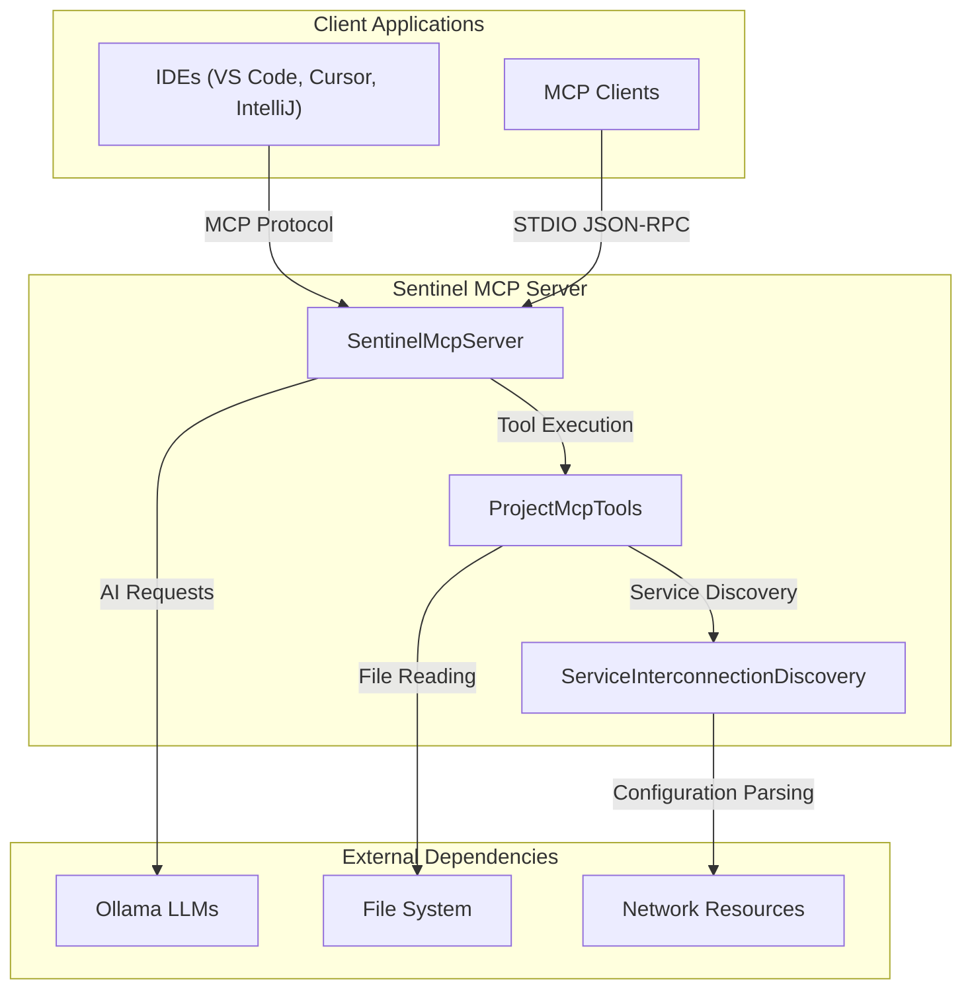

# SENTINEL ARCHITECTURAL AUDIT REPORT

## Executive Summary

This report presents a comprehensive architectural analysis of the Sentinel Backend AI microservice, a Java 21 application designed for local AI agent functionality with LangChain4j, Ollama, and MCP (Model Context Protocol) for corporate Java microservices analysis. The service implements an MCP server that exposes tools for project structure analysis and follows security-first principles with path traversal prevention.

**Key Findings:**
- The service properly implements MCP protocol with initialize, tools/list, and tools/call methods
- Security measures are in place to prevent path traversal attacks
- Java 21 features are utilized appropriately
- The architecture follows a modular design with clear separation of concerns

## Technical Breakdown

### Entry Points (Inbound Services)
Based on the service interconnection discovery:

1. **MCP Protocol Interface**
   - Protocol: MCP (Model Context Protocol) over STDIO
   - Endpoints: `initialize`, `tools/list`, `tools/call`, `shutdown`
   - Entry Point: `SentinelMcpServer.main()` method
   - Source File: `com.sentinel.arch.mcp.server.SentinelMcpServer.java`

2. **Command Line Interface**
   - Protocol: CLI via Picocli
   - Entry Point: `SentinelMain.main()` method
   - Subcommands: `analyze` (currently implemented)
   - Source File: `com.sentinel.arch.SentinelMain.java`

### External Dependencies (Outbound Calls)
Based on the discovery and pom.xml analysis:

1. **AI/LLM Libraries**
   - LangChain4j (v1.10.0) - Core AI functionality
   - LangChain4j-Ollama (v1.10.0) - Ollama integration for local LLMs

2. **MCP Protocol Support**
   - MCP SDK (v0.17.2) - Model Context Protocol implementation

3. **CLI Framework**
   - Picocli (v4.7.6) - Command-line interface

4. **JSON Processing**
   - Jackson (v2.18.2) - JSON serialization/deserialization

5. **Logging**
   - SLF4J (v2.0.16) - Logging facade
   - Logback (v1.5.14) - Logging implementation

6. **Build Tools**
   - Maven Compiler Plugin (v3.13.0)
   - Maven Shade Plugin (v3.6.0) - For creating fat JARs

## High-Level Service Topology

## Architectural Bottlenecks & Clean Code Violations

Based on the `java-architect-rules.prompt` analysis:

### 1. **Exception Handling Centralization Issue**
- **Location**: `SentinelMcpServer.handleRpcRequest()`
- **Issue**: Exceptions are handled locally within each request handler rather than using a centralized `@ControllerAdvice` pattern
- **Impact**: Makes debugging and monitoring harder across the application
- **Recommendation**: Implement a global exception handler for consistent error responses

### 2. **Mixed Language Documentation**
- **Location**: Throughout the codebase (Spanish comments in Java files)
- **Issue**: The codebase mixes Spanish and English comments/documentation
- **Impact**: Reduces maintainability for international teams
- **Recommendation**: Standardize all documentation and comments to English for consistency

### 3. **Potential Resource Leak Risk**
- **Location**: `SentinelMcpServer.startListeningLoop()`
- **Issue**: The BufferedReader and PrintWriter are not wrapped in try-with-resources
- **Impact**: Potential resource leaks if exceptions occur during processing
- **Recommendation**: Implement proper resource management with try-with-resources or ensure cleanup in finally blocks

## Actionable Refactoring Suggestions

### Immediate Actions (High Priority)
1. **Standardize Documentation Language**: Convert all Spanish comments to English to align with professional development standards
2. **Implement Global Exception Handler**: Create a centralized exception handling mechanism
3. **Add Resource Management**: Ensure proper cleanup of IO resources in the MCP server

### Medium-Term Improvements
1. **Add Health Checks**: Implement health check endpoints for better observability
2. **Configuration Management**: Separate configuration from code using external configuration files
3. **Metrics Collection**: Add metrics collection for performance monitoring

### Long-Term Enhancements
1. **Security Hardening**: Implement additional authentication mechanisms for MCP endpoints
2. **Caching Layer**: Add caching for frequently accessed file operations
3. **Async Processing**: Implement async processing for long-running operations

## Technology Stack Assessment

### Current Stack (Java 21)
- **Core**: Java 21 with virtual threads capability
- **AI Framework**: LangChain4j v1.10.0
- **Protocol**: MCP SDK v0.17.2
- **CLI**: Picocli v4.7.6
- **Serialization**: Jackson v2.18.2
- **Logging**: SLF4J/Logback v2.0.16/v1.5.14

### Deprecation Status
- **No deprecated libraries** identified in the current dependency tree
- **All dependencies** are current versions with active maintenance
- **Java 21** is the current LTS version, ensuring long-term support

## Conclusion

The Sentinel Backend AI microservice demonstrates solid architectural principles with appropriate use of modern Java features and secure coding practices. The MCP protocol implementation is well-designed and follows security best practices. The main areas for improvement relate to standardization of documentation language and refinement of exception handling patterns.

The service is well-positioned for continued development with a clean separation of concerns and appropriate use of external libraries.