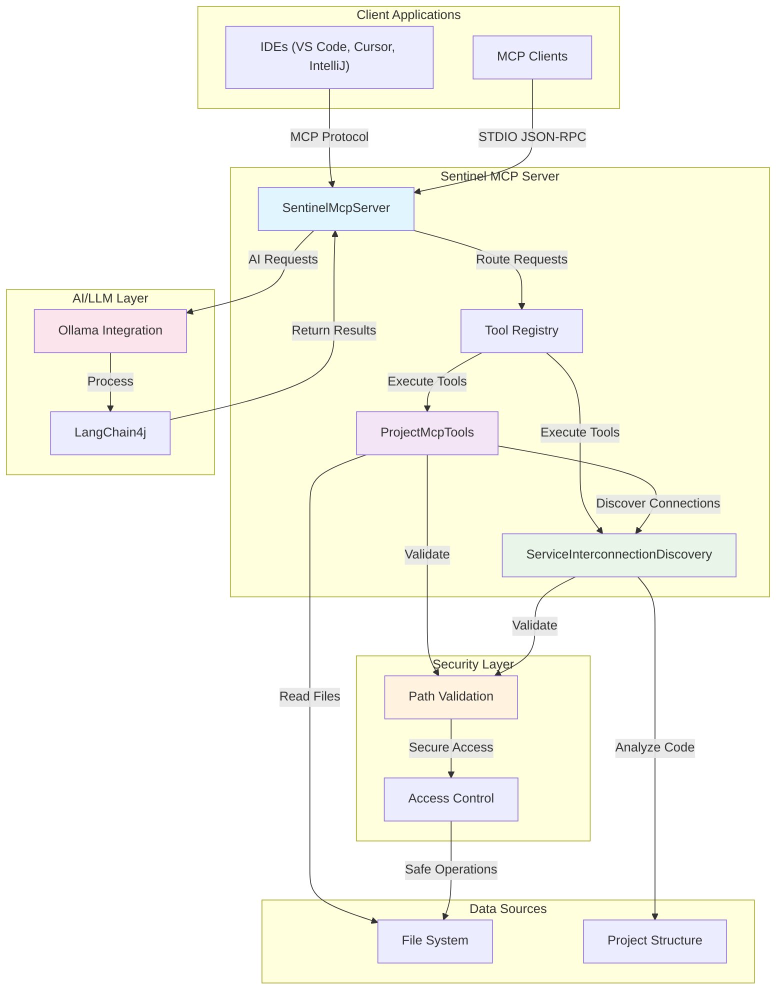

# SENTINEL PROJECT ARCHITECTURAL DISCOVERY

## Service Topology Overview

The Sentinel project is a Java-based Model Context Protocol (MCP) server designed for AI-assisted code analysis. It provides tools for analyzing Java microservice architectures using local AI models (Ollama) and LangChain4j.

## Inbound Protocols (Entry Points)

Based on the discovery and code analysis:

### 1. MCP Protocol Interface
- **Protocol**: Model Context Protocol (MCP) over STDIO
- **Entry Point**: `SentinelMcpServer.main()` method
- **Supported Methods**:
  - `initialize` - Initializes MCP session
  - `tools/list` - Lists available tools
  - `tools/call` - Executes specific tools
  - `shutdown` - Gracefully shuts down the server
- **Source File**: `com.sentinel.arch.mcp.server.SentinelMcpServer.java`

### 2. Command Line Interface
- **Framework**: Picocli
- **Entry Point**: `SentinelMain.main()` method
- **Commands**: Root command with `analyze` subcommand
- **Source File**: `com.sentinel.arch.SentinelMain.java`

## Outbound Dependencies & Calls

### 1. AI/LLM Integration
- **Library**: LangChain4j with Ollama integration
- **Purpose**: Local AI processing for code analysis
- **Source**: `com.sentinel.arch.ollama.OllamaConfig.java`

### 2. MCP Tools
- **Functionality**: Project structure analysis and file reading
- **Tools Provided**:
  - `readProjectStructure` - Lists project files and directories
  - `readJavaFile` - Reads specific Java files
  - `discover_service_interconnections` - Discovers service interconnections
- **Source**: `com.sentinel.arch.mcp.ProjectMcpTools.java`

### 3. External Service Calls
- **Maven Repositories**: Various Maven repositories for dependency resolution
- **Network Resources**: Configuration URLs for build processes

## Detailed Architecture Components

### Core Components
```
com.sentinel.arch/
├── SentinelMain.java          # Main application entry point
├── SentinelCommand.java       # CLI command structure
├── agent/                     # AI agent implementation
│   └── SentinelAgent.java
├── cli/                       # CLI command implementations
│   └── AnalyzeCommand.java
├── mcp/                       # MCP server implementation
│   ├── ProjectMcpTools.java   # MCP tools
│   ├── ServiceInterconnectionDiscovery.java  # Service discovery tool
│   └── server/
│       └── SentinelMcpServer.java  # MCP server implementation
└── ollama/
    └── OllamaConfig.java      # Ollama configuration
```

### MCP Server Architecture
The MCP server follows a modular design:

1. **Transport Layer**: STDIO-based communication
2. **Protocol Layer**: JSON-RPC 2.0 message handling
3. **Tool Registry**: Dynamic registration of available tools
4. **Security Layer**: Path traversal prevention and file access validation
5. **Business Logic**: Actual tool implementations

## Mermaid Flow Diagram



## Service Communication Flow

1. **Client Connection**: MCP clients connect via STDIO
2. **Initialization**: Client sends `initialize` request
3. **Tool Discovery**: Client requests `tools/list` to discover capabilities
4. **Tool Execution**: Client executes specific tools via `tools/call`
5. **Response Processing**: Server validates, processes, and returns results
6. **Session Management**: Proper session lifecycle with `shutdown` when complete

## Security Considerations

- **Path Traversal Prevention**: Validates file paths to prevent unauthorized access
- **File Type Restrictions**: Only allows reading specific file types (.java, .xml, .md)
- **Read-Only Access**: Prevents any write operations to the file system
- **Input Validation**: Sanitizes all inputs before processing

## Technology Stack

- **Language**: Java 21
- **Build Tool**: Maven
- **AI Framework**: LangChain4j
- **LLM Interface**: Ollama
- **MCP Protocol**: io.modelcontextprotocol.sdk
- **CLI Framework**: Picocli
- **JSON Processing**: Jackson
- **Logging**: SLF4J/Logback